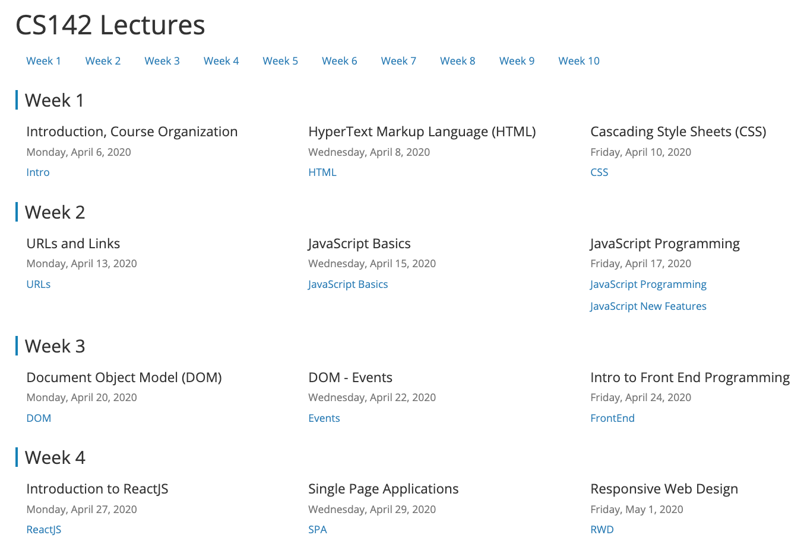
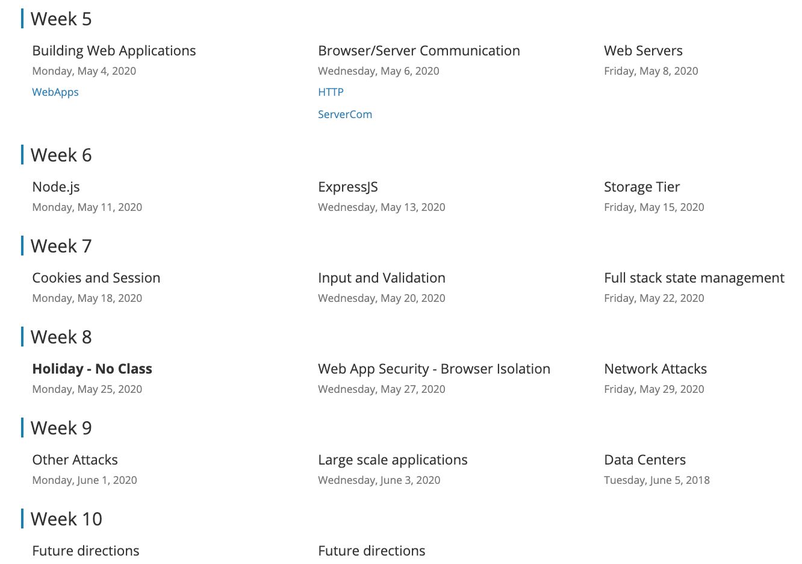

class: middle, center

# 资源分享

## 陈一帅
---
# 资源分享

- .red[学习资源]
- 教学资源
- 加入我们
---
# Khan算法入门（JS）笔记

- 儿童视角

.center[.width-40[] .width-40[]]

.center[微信公号]
---
# DK 少儿编程

- 从 Scratch 到 Python
- 剑桥大学作者，生动有趣，进度科学
- 英文，循序渐进，完成潜艇打泡泡 Python 游戏

## .center[.width-30[]]
---
# [谷歌 Blockly 编程](https://blockly-games.appspot.com/?lang=zh-hans)

- 为程序员设计的可视化编程，对应 Javascript 代码
- 直达算法、逻辑、循环、函数、变量等概念

.center[.width-70[]]
.center[B 站 [视频](https://h.bilibili.com/38320283)，[照片](https://www.bilibili.com/video/BV1oJ411F7aj) 链接]
---
# Java 编程

- 魏林老师基于斯坦福 CS106 编译
- 生动风趣，内容科学（[全套视频 B 站链接](https://space.bilibili.com/393215832/)）

.center[.width-100[]]

## <!-- * https://vijos.org/d/kidolab_2019_Spring/ -->
---
# [伯克利 WDD](https://wdd.io/resources/)

.center[.width-90[]]
.center[面向创业，设计和编程并进，内容一流]
---
# [伯克利 React DeCal](https://portal.reactdecal.org/semesters/1)

.center[.width-100[]]

## .center[项目制学习，内容详尽]
---
# [斯坦福 CS142 Web 应用](https://web.stanford.edu/class/cs142/lectures.html)

.center[.width-100[]]
.center[内容精干]
---
# [斯坦福 CS142 Web 应用](https://web.stanford.edu/class/cs142/lectures.html)

.center[.width-90[]]

.center[系统全面：前端 + 后端 + 运维]

<!-- - 新闻：https://chinese.freecodecamp.org/news/
- 社区概览：https://chinese.freecodecamp.org/forum/t/topic/250
- https://beta.freecodecamp.com/
- 42school -->
---
# [Quizlet](https://quizlet.com/class/13272136/)

- 谷歌“单词卡”工具
- 游戏式学习，对战，帮助记忆、复习

## .center[.width-80[]]
---
# [FCC 配套测验](https://admin.kaoshixing.com/examadmin/admin/exam_mgr_new)

- 200 道填空题，欢迎来电索取

## .center[.width-70[]]
---
# 资源分享

- 学习资源
- .red[教学资源]
- 加入我们
---
# 课程设计与教师职业发展

- 哈佛大学 Bok 教学中心：学生为中心的课程设计
- [在线资源](https://bokcenter.harvard.edu/online-resources)
- 以练习为中心
---
# CS 教学方法

- 斯坦福大学 Chris Gregg
- 课程：CS298/EDUC298：[如何教新手计算机科学](http://cs298.stanford.edu/)
- 课本：《[Your First Year Teaching Computer Science​](https://web.stanford.edu/class/cs298/cgi-bin/course-reader/)》
- 网站：[CS 教学小技巧](http://CSTeachingTips.org)
---
# 教育技术与应用学习科学

- CMU：[LearnLab](http://www.learnlab.org/)
- [METALS - 教育技术与应用学习科学硕士学位](https://www.hcii.cmu.edu/masters-educational-technology-and-applied-learning-science-program-overview)
- 图书《e-Learning and the Science of Instruction》
---
# 学生练习过程可视化

- 斯坦福大学 Chris Piech 团队
- code.org 50 万学生 [练习路径可视化](http://stanford.edu/~cpiech/demos/research/blossoms.html)
- 学生尝试中，从一种局部解决方案转向另一种局部解决方案的动态过程
- 学生模型：预测学习成果，风险
---
# 习题表征

- 冯梦菲，深度学习（自然语言处理）
- 习题文本深度表征，相似题推荐

## .center[.width-80[]]
---
# 智能导学

- 艾方哲
- 假设有无穷多、可无穷次尝试的学生
- 如何学习最佳导学策略
- 类似 AlphaGo

## .center[.width-90[]]
---
# 智能导学

- 深度知识追踪
- 基于深度强化学习的导学策略优化
- [论文及代码（Github）](https://bjtu-netcomm.github.io/nilab/2019/Aifangzhe/aifangzhe.html)

## .center[.width-70[]]
---
# 学生手册图像识别

- 潘翰祺，曹中
- 学生等第、评价、手写体数字识别

## .center[.width-80[]]
---
# 图像识别

- 表格拆分，目标检测
- 数据增强，图像识别

## .center[.width-40[] .width-40[]]
---
# 学术会议

- ACM Special Interest Group on Computer Science Education ([SIGCSE](http://sigcse2020.sigcse.org/))
- ACM Innovation and Technology in Computer Science Education ([ITiCSE](http://iticse.acm.org/))
- ACM Special Interest Group for Building Educational Applications (SIGEDU)
  - Workshop on Innovative Use of NLP for Building Educational Applications ([BEA](https://sig-edu.org/bea/current))
- Artificial Intelligence in Education([AIED](https://aied2020.nees.com.br/))
- Educational Data Mining ([EDM](http://educationaldatamining.org/edm2020/))
---
# [Canvas 教学系统](https://canvas.instructure.com/login/canvas)

- 课程管理工具，免费账号 500M 空间

## .center[.width-80[]]
---
# Autolab

- CMU Autolab + Gitlab 自动练习评分系统
  - 阿里云部署
  - 魏林老师，坐标深圳，职业教育创业中，欢迎合作
---
# 实务学堂教学材料（PDF）

- [学生手册](../doc/实务学堂CS学生手册（2020）.pdf)
  - 培养硬目标、软目标、需求、学习计划、考核、咨询
- [教学大纲](../doc/实务学堂Web教学大纲（2020）.pdf)
  - 基本信息、学习目标、设计思路、课程内容、教学安排、学生责任、评分方法
- [第一天上课友情提醒](../doc/上课第一天.pdf)
  - 破冰、设定期望、教学大纲
- [2019 年编程方向教学总结](../doc/编程小结v4.5.pdf)
  - 学年回顾、教师总结、下一步建议
---
# [纽约历史协会编程实验室](https://www.nyhistory.org/education/teen-programs/scholars-program)
- 面向女生
- 新冠病毒期间免费向全世界开放

## .center[.width-90[]]
---
# 纽约编程教案

- 纽约教育局 CS4All（[全套教案](cs4all.nyc/programs/courses/)）
- [CodeNation](https://codenation.org/) 系列课程教案

## .center[.width-60[]]
---
# 资源分享

- 学习资源
- 教学资源
- .red[加入我们]
---
# 志愿者

- 核⼼是好老师——⼈生“引路⼈”
- 想让学⽣成为什么样的人，就为学⽣寻找什么样的⽼师。
- [我们为什么来实务学堂当⽼师](https://mp.weixin.qq.com/s/xvw_42cvJRByRLS-0WqSGQ)
- 地点：北京昌平区小沙河工业园
- 目前还未开学，钉钉网上上课

---
# 流程（上课）
- 确定课程内容，制定教学计划
- 试课&选课
- 授课
  - 课程记录&总结
  - 持续⼀学期、每周1次及以上
- 教学总结
---
# 支持
- 午(晚)餐
- 交通补贴
- 团队
- 培训
- 外部交流机会
- 志愿者证书
- ⼩礼物
- 其他支持
---
# 实习机会

- 寻找
  - 暑期实习机会（月）
  - 毕业实习机会（年）
---
# 合作创业

- 魏林老师，深圳，职业教育（软件开发方向）创业中，欢迎合作
- “[我想做一种与众不同的教育](https://wlnirvana.com/2019/why-it-vocational-education/)”
  - 第一，它应当是有趣的，保守住孩子们天生具有的好奇心，而不是填鸭式地打击它。
  - 第二，它能够发现和培养一些人对科学的审美。
  - 第三，可能也是最重要的一条底线，我不希望它只服务于中上阶层，甚至是那些在学网球、赛马的孩子。我所追求的教育，应当是普惠性的，有利于社会公平。
---
# 为什么可以创业？

- 2016 年，美国劳工部估计，50 万空缺计算机科学职位
  - 占 STEM 职位的 60％ [1]
- 2017 年，麦肯锡估计
  - 到 2030 年，3.75 亿工人需要再培训 [2]

.footnote[.1. USA Bureau of Labor Statistics Employment Projections, 2016
 .2. Jobs lost, jobs gained. McKinsy Global Institute, 2017.]
---
# 中国呢？

- 面临同样挑战

## .center[.width-110[]]
---
class: middle, center

# 加入我们

.center[.width-100[]]
